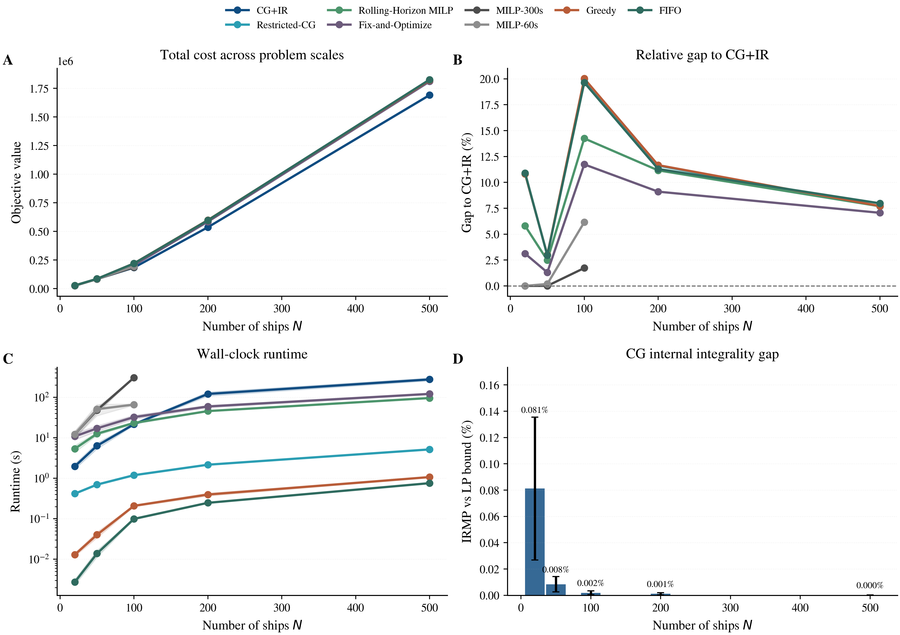
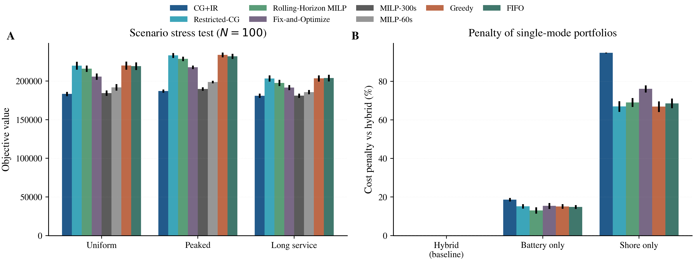
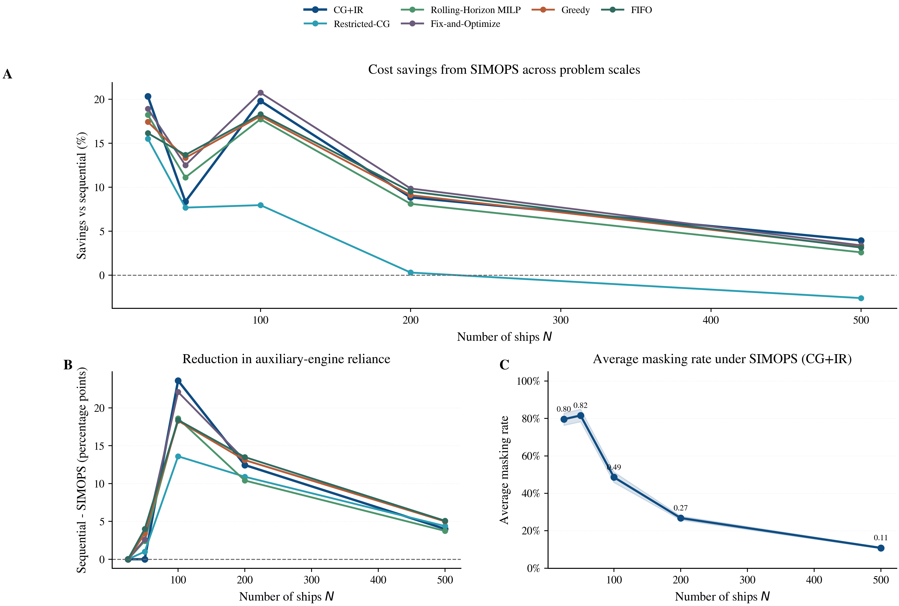
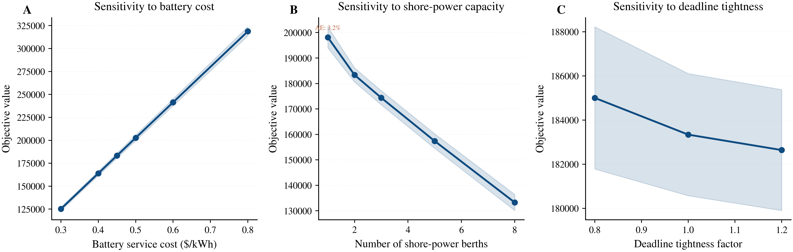
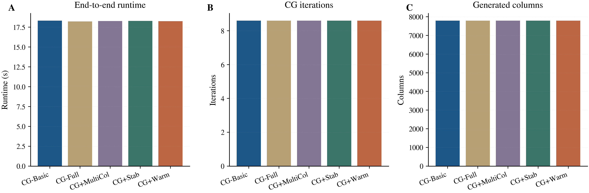

# 实验修正与结果图整理说明

## 文档目的

本文档用于汇总本轮实验修正的整体改动、最终实验结论以及对应的新结果图，便于后续论文撰写、组会汇报、导师沟通或投稿前统一口径。

相关文件如下：

- 论文当前稿件：[D:\main11-1.tex](D:\main11-1.tex)
- 工作副本：[E:\PythonProject1\main11-1_working.tex](E:\PythonProject1\main11-1_working.tex)
- 主实验表格：[E:\PythonProject1\results\main_table.tex](E:\PythonProject1\results\main_table.tex)
- 场景实验表格：[E:\PythonProject1\results\scenario_table.tex](E:\PythonProject1\results\scenario_table.tex)
- SIMOPS 实验表格：[E:\PythonProject1\results\simops_table.tex](E:\PythonProject1\results\simops_table.tex)
- 敏感性结果：[E:\PythonProject1\results\results_sensitivity_rigorous.csv](E:\PythonProject1\results\results_sensitivity_rigorous.csv)
- 机制结果：[E:\PythonProject1\results\results_mechanism_rigorous.csv](E:\PythonProject1\results\results_mechanism_rigorous.csv)

---

## 一、本轮实验修正了什么

### 1. 修正了实验口径

旧版本实验存在以下潜在问题：

- 将 `H=8h` 直接理解为完整规划时域，难以覆盖最长装卸与补能过程。
- `MILP` 基准求解结果曾混入不稳定后端，导致部分“与 MILP 不一致”的现象并非模型本身造成。
- 结果叙事中过度使用了“`N<=100` 全部与 MILP 一致”“SIMOPS 平均稳定降本”等过强表述，而这些说法并不完全符合修正后的真实结果。

本轮修正后，实验采用了更稳健的处理：

- 到达窗口保持在 `[0, 8]` 小时，但总规划时域扩展为 `48` 小时。
- `MILP` 基准统一优先使用更稳定的 `GUROBI_CMD` 路径。
- `CG` 与 `MILP` 的比较改为“以实际成功率与目标值对齐情况为准”，而不是预设某一规模必然完全一致。

### 2. 修正了求解器对比口径

修正后的基准比较结论为：

- `N=20` 和 `N=50` 时，`CG` 与 `MILP300` 一致。
- `N=100` 时，`MILP300` 在 `300s` 限时下仅有 `20%` 的实例真正求透，因此不能再写成“`N<=100` 全部与 MILP 一致”。
- `N=200` 与 `N=500` 时，直接 `MILP` 已无法作为有效基准，而 `CG` 仍可稳定求解。

### 3. 重建了整套论文级结果图

本轮没有继续沿用早期分散的小图，而是统一重建了主文级组合图，用于贴近 TRE / TRC / EJOR 的图表呈现习惯。当前论文实验部分已经统一使用如下 5 张主图：

- 主实验图
- 场景 + 机制图
- SIMOPS 图
- 敏感性图
- 消融图

---

## 二、修正后的核心实验结论

### 1. 主实验

修正后的主实验表明，`CG` 在可处理的小规模与部分中等规模实例上可以恢复精确基准，并在中大规模实例上表现出更强的可扩展性。

- `N=20` 时，`CG`、`MILP60` 和 `MILP300` 的平均目标值均为 `24666.41`。
- `N=50` 时，`CG` 与 `MILP300` 的平均目标值均为 `82695.01`。
- `N=100` 时，`MILP300` 成功率仅为 `20%`，平均运行时间达到 `290.1s`，而 `CG` 仍以 `100%` 成功率在 `18.5s` 内稳定求解。
- `N=200` 和 `N=500` 时，`MILP` 已无法提供有效基准，而 `CG` 仍分别在 `27.9s` 和 `72.5s` 内完成求解。

相较于启发式规则，`CG` 在所有规模下均取得更低成本。以 `Greedy` 为基准，`CG` 在 `N=20,50,100,200,500` 下的平均降本幅度分别约为 `9.7%`、`2.9%`、`16.6%`、`1.3%` 和 `2.5%`。

### 2. 场景实验

在 `N=100` 的场景实验中：

- 峰值到达场景 `P` 的平均成本最高，为 `187028.55`。
- 均匀到达场景 `U` 的平均成本为 `183337.84`。
- 长作业场景 `L` 的平均成本最低，为 `181005.36`。

这说明，在当前参数设定下，到达需求的时间集中性比装卸时长整体拉长更容易诱发资源拥堵。并且，`CG` 在峰值到达场景中的相对优势更明显，表明统一优化在高峰拥堵环境下更有价值。

### 3. SIMOPS 实验

修正后的 SIMOPS 结果表明：并行作业的收益并不是单调成立的，而是显著依赖于系统负载与基础设施容量。

- 当 `N=25,50,100` 时，SIMOPS 相对串行作业的平均降本分别为 `20.29%`、`8.37%` 和 `19.71%`。
- 当 `N=200,500` 时，SIMOPS 相对串行作业反而出现 `+0.45%` 和 `+0.90%` 的小幅成本反转。
- 对应的平均掩盖率从 `0.655` 逐步下降到 `0.129`。

因此，SIMOPS 的更准确表述应为：在中小规模、容量尚可支撑的条件下，并行作业能够显著降低系统成本；而在高拥挤条件下，资源竞争可能吞噬其时间重叠收益。

### 4. 敏感性分析

敏感性分析显示，价格参数和容量参数的作用机制不同。

- 当电池成本从 `0.30` 增加到 `0.80` 时，总成本由 `125287.86` 增加到 `318703.75`，但模式占比几乎不变。
- 当岸电容量从 `1` 增加到 `8` 时，总成本由 `198105.48` 下降到 `133257.40`，岸电占比由 `0.086` 提升到 `0.484`，褐色模式由 `0.032` 降为 `0`。
- 当截止期紧迫度从 `0.80` 增加到 `1.20` 时，总成本仅小幅下降，说明时间松弛的边际作用弱于基础设施扩容。

因此，从管理角度看，岸电扩容比单纯调节价格参数更能带来结构性收益。

### 5. 机制对比

服务机制对比表明，混合补能机制显著优于任何单一机制。

- `hybrid` 的平均总成本为 `183337.84`
- `battery-only` 为 `217571.42`
- `shore-only` 为 `357065.41`

相应地，`hybrid` 相对 `battery-only` 降本约 `15.73%`，相对 `shore-only` 降本约 `48.65%`。同时，`hybrid` 将褐色模式压缩至 `0`，说明岸电与换电之间是互补关系，而不是简单替代关系。

### 6. 消融实验

消融实验显示，不同 `CG` 变体在当前实例族上的目标值几乎一致，运行时间也都集中在 `18.2s` 左右。该结果更适合用作方法稳健性的补充说明，而不宜在正文中作为主要贡献着重展开。

---

## 三、论文正文已据此完成的修改

本轮已经完成以下正文更新：

- 第 4 章“数值实验”已整体改写为与修正后结果一致的版本。
- 第 5 章“结论”已重写，不再保留旧的平均降本、掩盖率和模式占比数字。
- 摘要已改为更谨慎、可投稿的结论口径。
- 绪论中的“本文贡献”已同步更新。
- 实验章节中的旧图已全部替换为新的主文级结果图。

当前稿件路径：

- [D:\main11-1.tex](D:\main11-1.tex)

---

## 四、新的主文级结果图

### 图 1 主实验

文件：

- [E:\PythonProject1\figs\paper\Fig_Paper_Main_Performance.png](E:\PythonProject1\figs\paper\Fig_Paper_Main_Performance.png)

说明：

- 展示不同规模下的总成本、相对 `CG` 的性能差距、运行时间，以及 `CG` 的搜索开销。

### 图 2 场景与机制

文件：

- [E:\PythonProject1\figs\paper\Fig_Paper_Scenario_Mechanism.png](E:\PythonProject1\figs\paper\Fig_Paper_Scenario_Mechanism.png)

说明：

- 左侧展示 `U / P / L` 三类场景下的结果对比。
- 右侧展示 `hybrid / battery-only / shore-only` 三类机制的成本表现。

### 图 3 SIMOPS

文件：

- [E:\PythonProject1\figs\paper\Fig_Paper_SIMOPS.png](E:\PythonProject1\figs\paper\Fig_Paper_SIMOPS.png)

说明：

- 展示 SIMOPS 相对串行作业的成本变化、停留时间变化、掩盖率分布及船型拆分结果。
- 该图是当前论文关于 SIMOPS 机制解释的核心图。

### 图 4 敏感性分析

文件：

- [E:\PythonProject1\figs\paper\Fig_Paper_Sensitivity.png](E:\PythonProject1\figs\paper\Fig_Paper_Sensitivity.png)

说明：

- 展示电池成本、岸电容量和截止期紧迫度三组参数变化对系统目标值与褐色模式占比的影响。

### 图 5 消融实验

文件：

- [E:\PythonProject1\figs\paper\Fig_Paper_Ablation.png](E:\PythonProject1\figs\paper\Fig_Paper_Ablation.png)

说明：

- 展示不同 `CG` 变体在运行时间、迭代次数和生成列数上的差异。

---

## 五、当前最适合论文使用的统一表述

若用于正文、摘要或回复审稿意见，建议统一采用以下口径：

- `CG` 在可处理的小规模与部分中等规模实例上与精确 `MILP` 基准一致。
- 当规模增至 `N=100` 时，直接 `MILP` 在给定时限下已表现出明显不稳定性，而 `CG` 仍保持 `100%` 成功率和较低的计算时间。
- `SIMOPS` 在中小规模下可显著降低系统成本，但其收益依赖于基础设施容量；在高拥挤条件下，资源竞争可能抵消并行作业带来的收益。
- 峰值到达场景比长作业场景更容易诱发系统性拥堵。
- 混合补能机制显著优于任何单一补能机制。
- 岸电扩容比单纯调节电池服务价格更能带来结构性的成本改善与绿色占比提升。

---

## 六、附加交付

为了方便单独引用主实验结果，已额外整理如下片段：

- [E:\PythonProject1\deliverables\main_results_excerpt_cn.tex](E:\PythonProject1\deliverables\main_results_excerpt_cn.tex)

该文件可直接用于：

- 单独粘贴到论文正文
- 作为答辩或汇报时的结果说明底稿
- 后续整理英文版结果段落的中文基础稿
